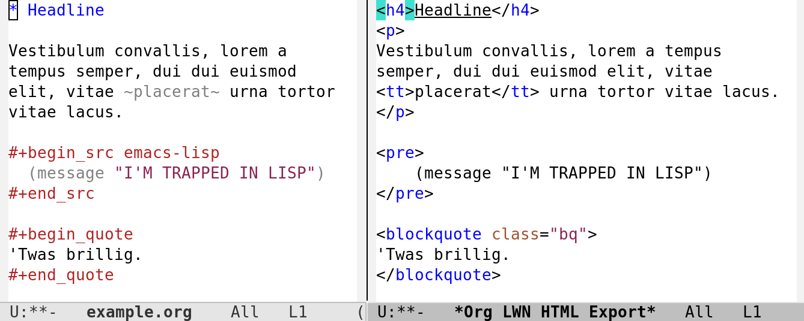

* LWN HTML Org Exporter

Provides an org-mode exporter for HTML that conforms to the guidelines for [[https://lwn.net/op/AuthorGuide.lwn][LWN contributors]].

#+ATTR_HTML: :width 75%

For an extended explanation behind the rationale for this package and some history, read [[*Background]].
Otherwise, continue reading to learn how to get started with this package.

** Installing

Not yet published; so use ~:vc~ in emacs >= 30:

#+begin_src elisp
(use-package ox-lwn-html
  :vc (:url "https://github.com/tylerjl/ox-lwn-html")
  :after org)
#+end_src

** Usage

Call ~org-export-dispatch~ in an ~org-mode~ buffer with ~C-e~ and use the default prefix for this exporter (~L~).

** Writing compatible org

In general, this package relies on standard org forms for capturing formatting and metadata upon export, but there are some patterns to follow in order to ensure the export ends up looking maximally correct.

The most salient piece of advice is that when it comes time for a final export of a submission HTML file, you should 1) toggle body-only export with ~C-b~ and 2) optionally export the subtree only with ~C-s~ if you're working on a single subtree in a larger org document.
For a more complete HTML preview for use in a browser during the writing process, you probably don't want body-only export (~C-b~) for more complete HTML.
Also:

+ Use ~#+CAPTION: text~ or ~#+ATTR_HTML: :alt text~ to enrich images with alt text for accessibility.
+ When direct-quoting, wrap with double quotes /twice/ to automically use ~<q>~ tags. For example:
  #+begin_example
  ""Vi vi vi, the sign of the beast"", intoned the priest.
  "That's what the texts say, anyway."
  #+end_example
+ Keep ~[[file:<path>]]~ links as standalone lines to let the exporter strip extraneous ~
~ and ~
~ tags.
+ As of now, the exporter doesn't handle images in any special way.
  If you're submitting images with a draft, you probably just need to attach those as separate files alongside the exported HTML.

** Background

** Development

Write tests in ~tests/~ using [[https://github.com/jorgenschaefer/emacs-buttercup][buttercup]].
Add to an existing test file, or if deserving of a standalone battery of tests, create it and then add to ~all.el~.

100% coverage and passing tests are enforced.
There are some helpers in the test files to run them interactively; and a custom buttercup matcher called src_emacs-lisp[:exports code]{:parses-into} is available to make testing src_emacs-lisp[:exports code]{org-mode} transation into HTML easier.

Run tests from the command line with ~just~.

Both ~emacs~ and ~just~ are bundled in the Nix devshell.
With Nix installed, either drop ~use flake~ into ~.envrc~ to use it automatically or invoke standalone with:

: nix develop . --command just
